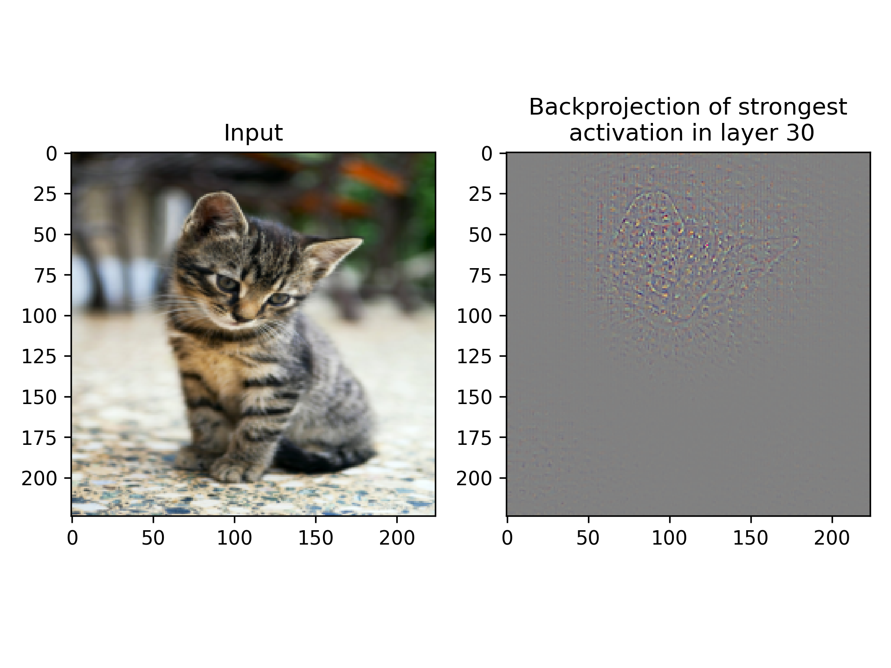

Implementation of the back-projection of activations published in [1].
Example:

[1]: Zeiler, M.D. and Fergus, R., 2014, September. Visualizing and understanding convolutional networks. In European conference on computer vision (pp. 818-833). Springer, Cham.
